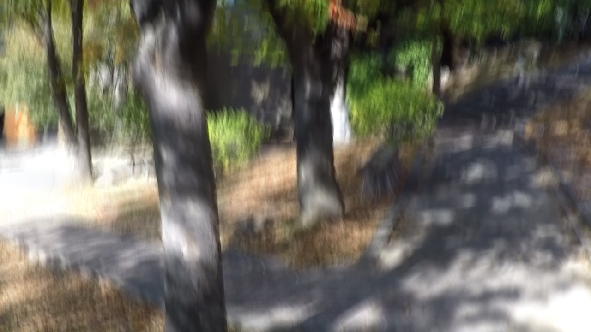
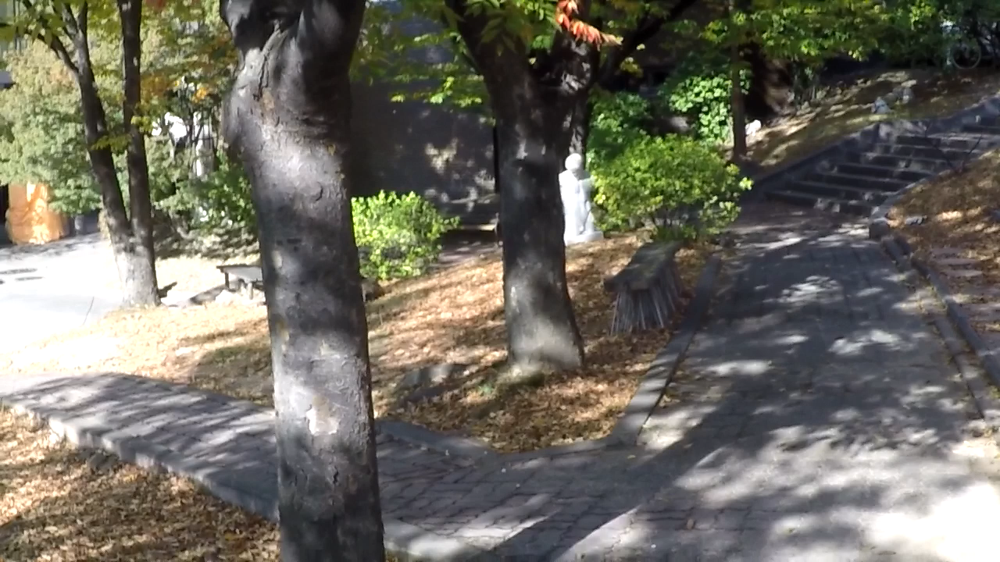
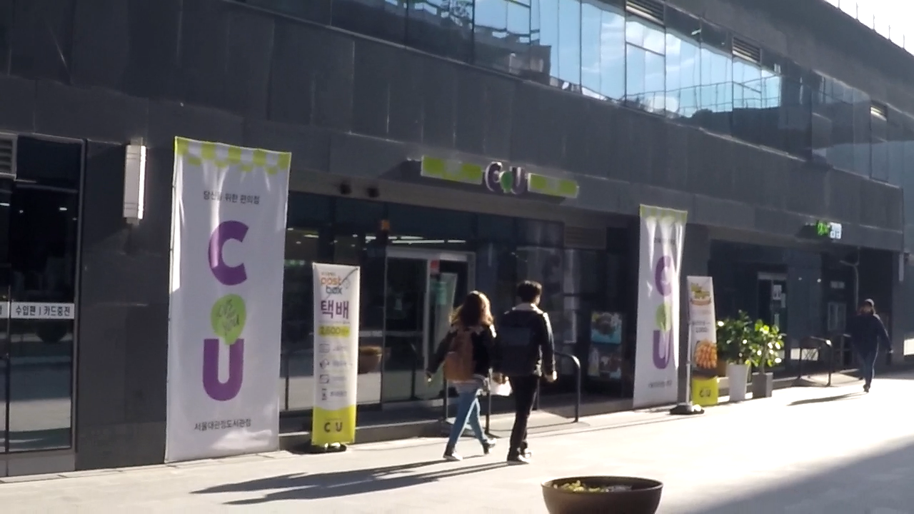

# 🔍 Image Sharpening using Knowledge Distillation

> 🚀 Internship Project Repository  


Welcome to the **Image Sharpening** project! ✨ This repository hosts my internship work focused on building a **lightweight, high-performance image sharpening solution** using **Knowledge Distillation (KD)**. The goal is to replicate the quality of a powerful teacher model (Restormer) with a compact student model, ideal for real-time use cases like **video conferencing**.

| Original Blurry Image | Sharpened Image (Teacher Model) | Sharpened Image (Student Model) | 
| :-------------------- | :------------------------------ |
|  |  |  |
|  |  |  |

---

## 📚 Table of Contents

- [🚀 Project Overview](#project-overview)
- [🌟 Features](#features)
- [📁 Project Structure](#project-structure)
- [🛠️ Setup and Installation](#setup-and-installation)
- [📊 Dataset](#dataset)
- [🧠 Models](#models)
- [🏋️‍♀️ Training](#training)
- [🚀 Inference](#inference)
- [📈 Performance Evaluation](#performance-evaluation)
- [💡 Future Work](#future-work)
- [📄 License](#license)

---

## 🚀 Project Overview

This project applies **Knowledge Distillation** to transfer knowledge from a **Restormer-based teacher model** to a **U-Net-based student model**. By doing so, we aim to:
- Enhance **image sharpness**
- Maintain **real-time processing speed**
- Enable deployment in **low-resource environments**

---

## 🌟 Features

✅ **Restormer-Based Knowledge Distillation**  
✅ **Multi-Loss Training Objective** (L1, SSIM, Perceptual, KL, Feature Distillation)  
✅ **Custom GoPro Sharpening Dataset Loader**  
✅ **Efficient Tiling Strategy** for High-Resolution Inference  
✅ **Metrics: PSNR, SSIM, FPS**  
✅ **Training Optimizations:** EMA, Cosine LR, Grad Accumulation

---

## 📁 Project Structure

```bash
sharpen_kd/
├── main_sharpening_script.py
├── Restormer/
│   ├── basicsr/models/archs/restormer_arch.py
│   └── Motion_Deblurring/pretrained_models/motion_deblurring.pth
├── GoPro_dataset/
│   ├── train/{blurred,sharp}
│   └── test/{blurred,sharp}
├── model_checkpoints/
├── inference_samples/sharpened_test_outputs/
└── .gitignore
```
# Setup and Installation 🛠️

## Prerequisites

* Python 3.x
* Git

## Cloning the Repository

First, clone this repository along with its Git submodule:

```bash
git clone [https://github.com/your-username/sharpen_kd.git](https://github.com/your-username/sharpen_kd.git)
cd sharpen_kd
git submodule update --init --recursive
```
