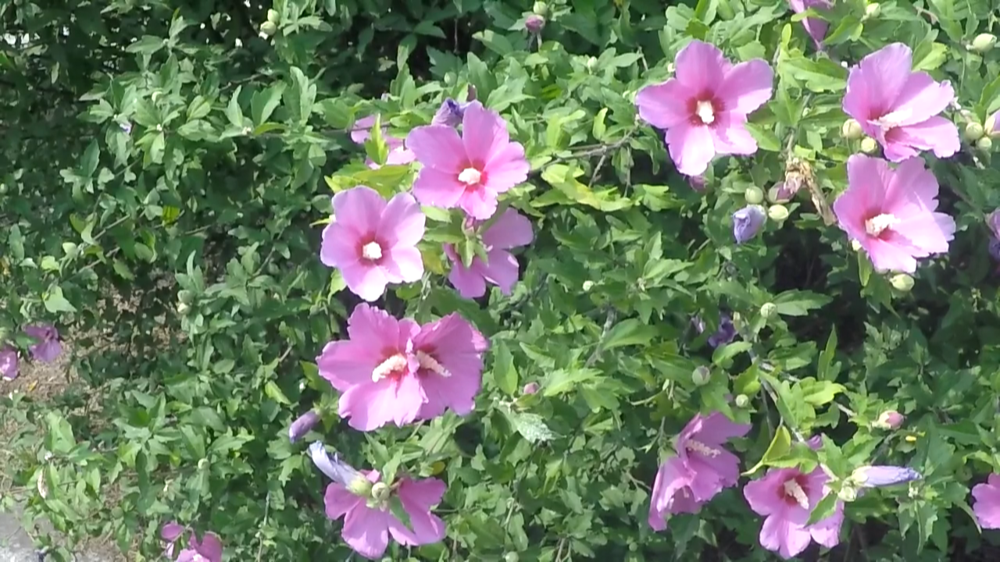

# Internship Report: Image Sharpening using Knowledge Distillation 🚀
**Intel Unnati Project Repository**


The full internship report detailing this project is available within this repository.
📄 [View Full Report (PDF)](Project_Report_Intel_Summer_Training_compressed.pdf)


Welcome to the Image Sharpening repository! ✨ This project focuses on developing an efficient and high-quality image sharpening solution using **Knowledge Distillation (KD)**. My goal is to train a lightweight model that can achieve impressive visual results by learning from a more complex, pre-trained teacher model, making it suitable for real-time applications like video conferencing.

---
📚 Table of Contents
* [Project Overview](#project-overview)
* [Visual Showcase 📸](#visual-showcase-)
* [Features 🚀](#features-)
* [Project Structure 📁](#project-structure-)
* [Setup and Installation 🛠️](#setup-and-installation-️)
    * [Prerequisites](#prerequisites)
    * [Cloning the Repository](#cloning-the-repository)
    * [Python Dependencies](#python-dependencies)
    * [Restormer Pre-trained Weights](#restormer-pre-trained-weights)
* [Dataset 📊](#dataset-)
* [Models 🧠](#models-)
    * [Teacher Model: Restormer](#teacher-model-restormer)
    * [Student Model: Lightweight U-Net with SE Blocks](#student-model-lightweight-u-net-with-se-blocks)
* [Training 🏋️‍♀️](#training-️)
    * [Loss Functions](#loss-functions)
    * [Training Process](#training-process)
* [Inference 🚀](#inference-)
* [Performance Evaluation 📈](#performance-evaluation-)


---

## Project Overview

This project implements an **image sharpening solution leveraging Knowledge Distillation (KD)**. The core idea is to distill the knowledge from a large, powerful **teacher model (Restormer)** into a more compact and efficient **student model (Lightweight U-Net with SE Blocks)**. This approach aims to achieve high-quality sharpening comparable to the teacher, but with significantly reduced computational overhead, making it ideal for applications requiring real-time performance, such as video conferencing.

---

## Visual Showcase 📸


### Before & After Examples
Showcase a clear comparison between the original blurry input images and the sharpened output from your model. Aim for diverse examples (e.g., text, faces, natural scenes).

| Original Blurry Image | Sharpened Image (Student Model) |
|---|---|
|  |  |
|  |  |
|  |  |
|  |  |
|  |  |


---

## Features 🚀

* **Knowledge Distillation**: Utilizes a robust **Restormer model** as the teacher to guide the training of a more efficient student network.
* **Custom Dataset Loader**: Implements a `GoProSharpeningDataset` for flexible data loading, including on-the-fly augmentations.
* **Comprehensive Loss Functions**: Combines multiple loss components for effective training:
    * **Reconstruction Loss (L1)**: Measures pixel-wise similarity.
    * **Perceptual Loss (VGG-based)**: Ensures high-level feature similarity for visually pleasing results.
    * **Feature Distillation Loss (L1)**: Mimics intermediate feature representations from the teacher.
    * **KL Divergence Loss**: Aligns the output distributions of the student and teacher.
    * **SSIM Loss (1 - SSIM)**: Directly optimizes for structural similarity.
* **Optimized Training**:
    * **Cosine Annealing Warm Restarts**: Learning rate scheduling for improved convergence.
    * **Exponential Moving Average (EMA)**: Maintains a more stable and robust version of the student model weights.
    * **Gradient Accumulation**: Effectively increases batch size to simulate larger batch sizes, improving training stability and memory efficiency.
* **High-Resolution Inference**: Includes a **tiling strategy** for processing images larger than the model's native input resolution, preserving detail and managing memory.
* **Performance Metrics**: Evaluates models using industry-standard **PSNR** and **SSIM**, along with **Frames Per Second (FPS)** measurement. ⏱️

---

## Project Structure 📁

The project follows a modular structure to keep components organized. This tree-like representation is the standard and most effective way to display directory structures in a GitHub README:


## Setup and Installation 🛠️

### Prerequisites
* **Python 3.x**
* **Git**

### Cloning the Repository
First, clone this repository along with its Git submodule:

```bash
git clone [https://github.com/your-username/sharpen_kd.git](https://github.com/your-username/sharpen_kd.git)
cd sharpen_kd
git submodule update --init --recursive
```
### Python Dependencies

Install the required Python packages. It is highly recommended to use a virtual environment.
```bash
# Create a virtual environment (optional but recommended)
python -m venv venv

# Activate the virtual environment
# On Windows:
.\venv\Scripts\activate
# On macOS/Linux:
source venv/bin/activate

# Install PyTorch (ensure CUDA version matches your GPU if applicable)
# Example for CUDA 11.7:
pip install torch==1.13.1+cu117 torchvision==0.14.1+cu117 torchaudio==0.13.1+cu117 --extra-index-url [https://download.pytorch.org/whl/cu117](https://download.pytorch.org/whl/cu117)
# For CPU only:
# pip install torch==1.13.1+cpu torchvision==0.14.1+cpu torchaudio==0.13.1+cpu --extra-index-url [https://download.pytorch.org/whl/cpu](https://download.pytorch.org/whl/cpu)

# Install other dependencies
pip install numpy scipy Pillow natsort tqdm scikit-image einops basicsr==1.4.2
```

---

### Restormer Pre-trained Weights
The teacher model (**Restormer**) requires pre-trained weights for motion deblurring.

1.  **Download**: Manually download `motion_deblurring.pth` from: `https://github.com/swz30/Restormer/releases/download/v1.0/motion_deblurring.pth`
2.  **Placement**: Place the downloaded file into the following directory: `sharpen_kd/Restormer/Motion_Deblurring/pretrained_models/`

---

## Dataset 📊

This project utilizes the **GoPro dataset** (or a similar dataset structured like it) for training and evaluation.

### Dataset Characteristics:
* The dataset consists of pairs of blurry and corresponding sharp (ground truth) images.
* It's expected to contain diverse categories, including text, nature, people, animals, and games, to ensure broad applicability of the sharpening model.
* The blurry images should ideally simulate conditions found in real-world scenarios, such as video conferencing, potentially generated by downscaling and upscaling ground truth images using bicubic/bilinear methods, or introducing various types of blur (e.g., motion blur, compression artifacts).

### Structure:
Ensure your dataset is organized within the `GoPro_dataset/` directory as follows:

'
## Models 🧠

### Teacher Model: Restormer
The teacher model is a pre-trained **Restormer** network, a powerful transformer-based architecture specifically designed for image restoration tasks like deblurring. It provides high-quality feature representations and outputs that the student model learns to mimic through knowledge distillation.


### Student Model: Lightweight U-Net with SE Blocks
The student model is a custom-designed, lightweight **U-Net variant integrated with Squeeze-and-Excitation (SE) blocks**.

* **U-Net Architecture**: Provides an encoder-decoder structure with skip connections, effective for image-to-image translation tasks.
* **Squeeze-and-Excitation Blocks**: These attention mechanisms are incorporated into the convolutional blocks to allow the model to adaptively recalibrate channel-wise feature responses, enhancing feature learning efficiency and performance while maintaining a relatively small footprint.

The student model is designed to be significantly more compact and faster than the teacher, making it suitable for real-time applications.

---

## Training 🏋️‍♀️

The training process employs knowledge distillation, where the student model learns from both the ground truth sharp images and the outputs/intermediate features of the teacher model.

### Loss Functions
The training objective is a composite loss function:

$L_{total} = \lambda_{recon} \cdot L1_{Reconstruction}(S_{out}, GT) + \lambda_{perceptual} \cdot L_{Perceptual}(S_{out}, T_{out}) + \lambda_{feature\_distillation} \cdot L1_{Feature\_Distillation}(S_{feat}, T_{feat}) + \lambda_{kl\_div} \cdot KL_{Divergence}(S_{out}, T_{out}) + \lambda_{ssim} \cdot (1 - SSIM(S_{out}, GT))$

Where:
* $S_{out}$ is the student model's output
* $T_{out}$ is the teacher model's output
* $S_{feat}$ are intermediate features from the student model
* $T_{feat}$ are intermediate features from the teacher model
* $GT$ is the ground truth sharp image

The weights ($\lambda$) for each loss component are configurable within `LossConfig`.

### Training Process
To start training, simply run the main script:

```bash
python main_sharpening_script.py
```

* **Epochs**: The model is trained for **50 epochs**.
* **Optimizer**: **Adam optimizer** is used.
* **Learning Rate Scheduler**: **Cosine Annealing Warm Restarts** dynamically adjusts the learning rate.
* **Gradient Accumulation**: Used to simulate larger batch sizes, improving training stability and memory efficiency.
* **Exponential Moving Average (EMA)**: An EMA version of the student model is maintained and saved as the final checkpoint, typically yielding better generalization performance.
* **Checkpoints**: The final EMA model checkpoint (`student_model_ema_final_epoch_050.pth`) is saved in the `model_checkpoints/` directory.
* **Evaluation during Training**: The model is periodically evaluated on the test set every **5 epochs**, and sharpened output images from the test set are saved to `inference_samples/sharpened_test_outputs/`.

---

## Inference 🚀

After training, you can use the trained student model to sharpen new blurry images. The `main_sharpening_script.py` also handles inference, allowing you to specify input images for sharpening. The high-resolution inference feature ensures that even large images can be processed effectively using the tiling strategy.

---

## 📈 Performance Evaluation

| **Metric**                          | **Student Model**   |
|-------------------------------------|---------------------|
| 1. SSIM                             | 0.9120              |
| 2. PSNR                             | 28.4293 dB          |
| 3. FPS (512×512, no tiling)         | 45 FPS              |
| 4. FPS (1920×1080, with tiling)     | 12 FPS              |

The performance of the trained student model is evaluated using standard image quality metrics and speed measurements:

* **Peak Signal-to-Noise Ratio (PSNR)**: A common metric for measuring the quality of reconstruction of lossy compression codecs or other image restoration tasks. Higher PSNR indicates better quality.
* **Structural Similarity Index Measure (SSIM)**: A metric that assesses the similarity between two images, considering luminance, contrast, and structure. Values closer to 1 indicate higher similarity.
* **Frames Per Second (FPS)**: Measures the inference speed of the model, crucial for real-time applications.


